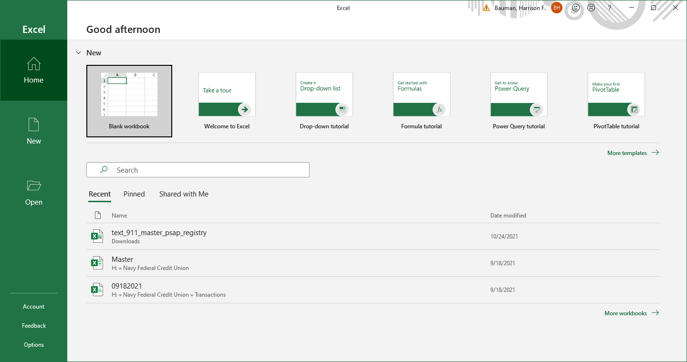
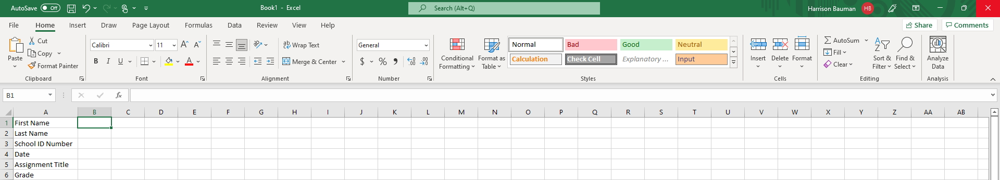
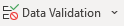
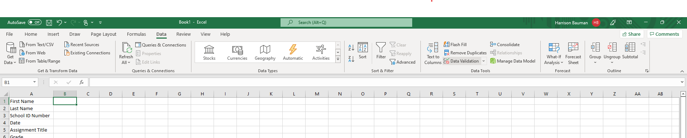

# Data Validation in Excel
###### Harry Bauman

<!-- Talk about what it is -->
The data validation tool in Excel allows the creator of a spreadsheet to specify restrictions on the data entered in particular cells. You may set the data validation setting to:
- Any value
- Whole number
- Decimal
- List
- Date
- Time
- Text length
- Custom (a custom rule that you write)

For certain Allow types, it makes sense to specify what range of data is permitted. For all options except List and Custom, you may select a data range related to minimum and maximum values. You have the option of selecting a range of:
- between
- not between
- equal to
- not equal to
- greater than
- less than
- greater than or equal to
- less than or equal to

<!-- Talk about why it is a useful tool -->
This tool is extremely useful for ensuring that your data is collected in the form that you expect. It prevents:
1. An inattentive or unfamiliar user from entering a text comment in a cell that should have numerical data
2. Some data entry errors that are easily detected, such as a value that is outside of the possible domain

The data validation tool also allows you to enter an "input" and an "error" message. These allow you to prompt your user for the data that you are expecting to be entered in a given cell and to inform the user of what has gone wrong if they attempt to enter a disallowed value in the cell.

<!-- Talk about how to use the tool -->
## Step 1 - Open Excel
You should begin by opening Excel. If you have a specific spreadsheet that you wish to edit, you may open it or you can start a new spreadsheet.

### Step 1a - Opening a blank workbook.
If you are starting from scratch, you should open a blank workbook.

## Step 2 - Label cells, columns, or rows
If appropriate, you should label your data so that any readers can easily understand what is being recorded in your spreadsheet. In this example, I am creating a header for a template file that students could use when submitting assignments. It contains the student's first name, last name, school ID number, date, assignment title, and grade. We will use the data validation tool to ensure that the students don't enter weird information in the corresponding cells so that we can use automation in Excel to process the assignments.

## Step 3 - Select the Cell to validate
Click on cell B1

## Step 4 - Open Data Validation
Select Data->.

<!-- Link to an excel spreadsheet -->

<!-- Link to the Microsoft page on that is a different presentation of the same information -->
